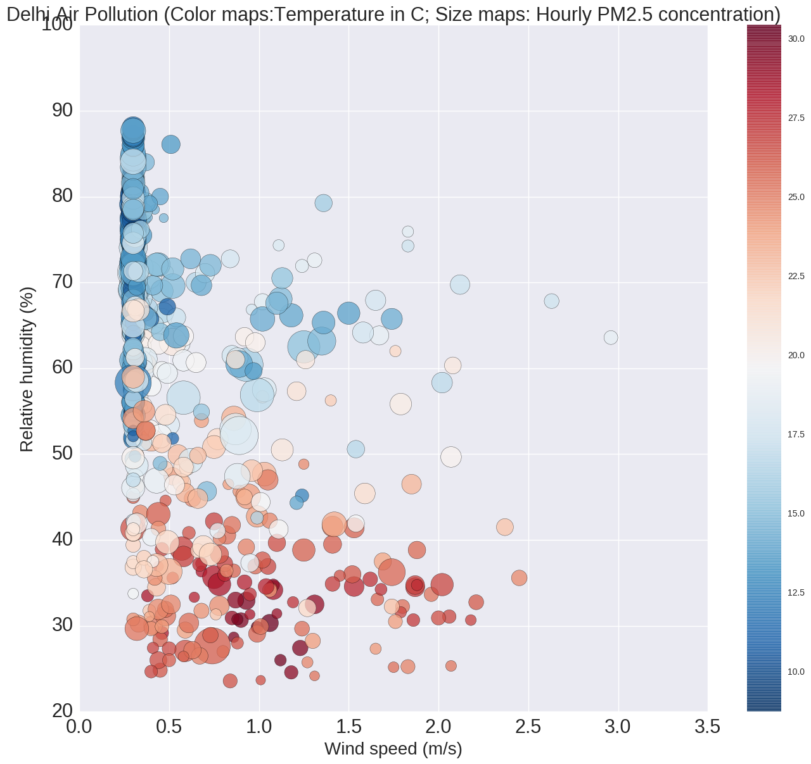

Hey Avikal.

First things first - I would like to point out the color schemes that was added for the benifit of the color-blind 
people - that is a great implementation of the different kinds of ways one can make plots better.

The only aspect of your plot that has any need to be edited is:
- The fact that they are huge plots. As in size wise they could have been smaller which would make it easier to see and easy on the eyes, this way no one would find the need to scroll down to see the whole length of the plot.

As of the plot above - the only thing I could find that was off were the labels of the y-axis and the title of the plot. The small overlap made it stand out - otherwise like I mentioned above - the plot is perfect.

As per the plot above - the legend would not be necessary due to the fact that there is nothing to serperate or differentiate in the plot after plotting - just one variable would not be difficult to distinguish.

The data has been clearly defined and the plotting with respect to what you would want to show has been portrayed clearly and I have been able to understand what it is that you are trying to define and show.

Also, the fact that I know of Delhi and the pollution that exists there has made it even more interesting to me and I have cleared a lot of misconceptions that I had about it as well.

Overall, I think this is a great visualization code and the plots seem to be as close to being perfect as possible.
