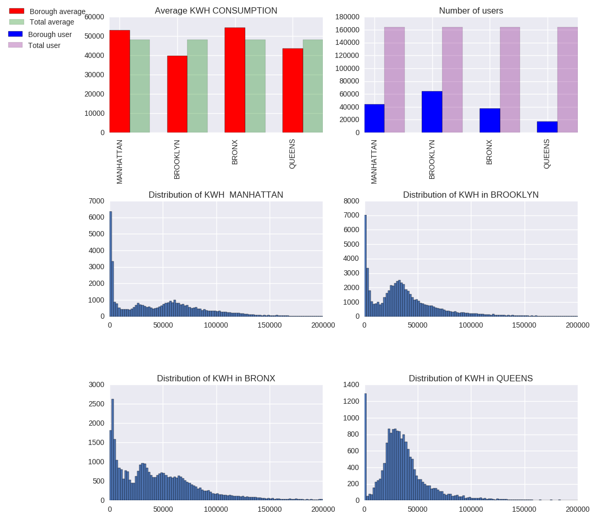

Hey Nicola.

The plot looks great !!
The data you wanted to interpret and the plot shows the different boroughs and the distribution in each is perfectly clear.

The only aspect of your plot that needs a little bit of editing is the one huge plot itself - it would have been better to show the distribtions of the boroughs in a separate plot altogeather.

The first two plots need not have combined and even if they were combined - the legend should have been seperate because it gets confusing when the legend has the markings of two different plots togeather.\

Also, there are no lables for the x and y axes on all 6 distributions but again that would have not been possible because you plotted all in one space - so every other aspect that could be wrong is mainly due to the confined plotting.

Another plotting issue that could be noticed is that there is no title for the plot. And no caption or description. Maybe that could hamper the plot understanding a bit.

Inspite of the above comments however - I was still able to understand and see clearly what you wanted to express with the data and how you wanted to portray the visualization so over all I think that the plotting was good.

