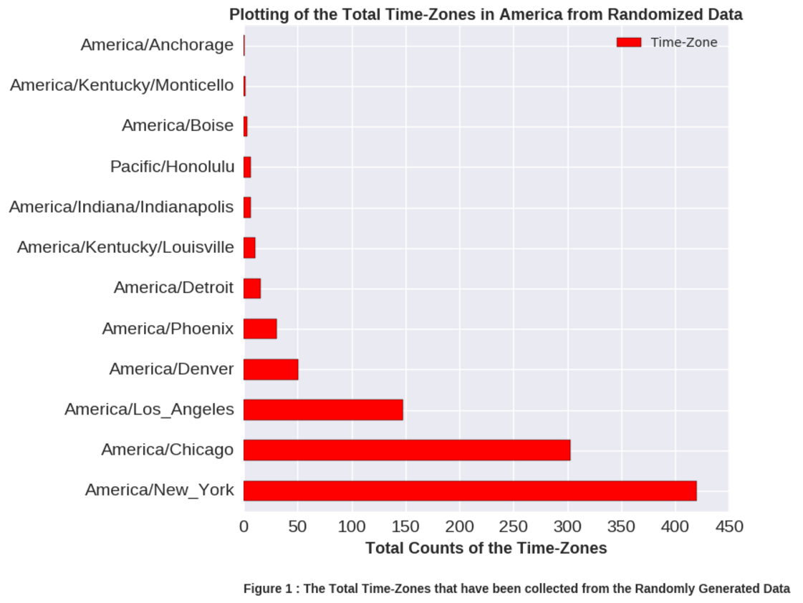

Hi Achilles, Great work with the plots!

# Comments:

1) The plot is clear. Labels are visible. The legend is not required since you are plotting a single variable

2) The caption size is small which can be made a little bit larger. 

3) Since, the data is randomly generated, its hard to understand the meaning to the graph. Generally the caption is used to explain what going on in the graph

#### Figure 2: Randomly Plotted Data - Trying to plot a 3-D bar chart.

This is a randomly generated 3-d bar plot.

# Comments:

1) A general suggestion, 3d graphs are not normally preferred. They do look nice but they tend to misrepresent the data.

2) The labels of X,Y,Z axis are not properly displayed, maybe while plotting you can try to increase the size of figure so that they are visible

3) The data is random so there are no legends, which is understandable. 

4) Explaining what the grey bar represents would help.
